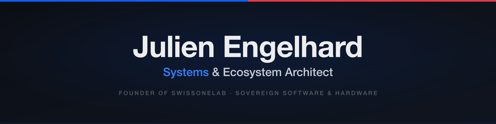

 

*Building secure, automated, AI-assisted engineering platforms from Switzerland — founder of [**SwissOneLab**](https://github.com/swissonelab).*

 

---

### About me

I'm a **systems & ecosystem architect** (DevSecOps background) who designs coherent, sovereign
ecosystems — **from hardware to software, from product to brand** — with a strong bias for
**security-first, local-first design**.
By day I architect platform environments; by night I explore cybersecurity, reverse engineering, and AI agents.

- Founder of **[SwissOneLab](https://github.com/swissonelab)** — a modular, security-first engineering platform built for resilience and digital sovereignty
- Passionate about **security-first architecture**, system hardening, and operational governance
- Building **local-first, sovereign tooling** — offline-capable apps that keep data under the user's control
- Orchestrating **local AI agents** on Apple Silicon (Ollama, MLX) alongside Claude-powered engineering workflows
- Crafting **native macOS apps** (SwiftUI) and **Rust TUIs** with a focus on polish and offline reliability
- Based in **Switzerland**, working with teams worldwide

---

### What I Do

| Domain | Focus |
|---|---|
| **Platform Engineering** | Modular multi-environment infrastructure, IaC, controlled delivery |
| **Security Architecture** | Hardening, threat modeling, governance & compliance |
| **DevSecOps Automation** | CI/CD pipelines, observability, automated maintenance |
| **Cybersecurity Operations** | Pentest, OSINT, forensics, reverse engineering |
| **Sovereign & Local-First Tooling** | Offline-capable, privacy-first apps; data ownership by design |
| **Native macOS & TUI Development** | SwiftUI desktop & menu-bar apps, Rust/Ratatui terminal interfaces |
| **AI Agents & Local LLMs** | On-device LLM orchestration (Ollama, MLX), agentic workflows, Claude-powered engineering |

---

### Tech Stack

<b>Platform & DevOps</b>

 

<b>Automation & CI/CD</b>

 

<b>Cyber & Security</b>

 

<b>Languages & Frameworks</b>

 

<b>Desktop & TUI</b>

 

<b>AI & LLM</b>

 

<b>macOS Environment</b>

 

---

### Featured Projects

> Products built under [**@swissonelab**](https://github.com/swissonelab)

| Project | Description | Stack |
|---|---|---|
| **[Xodia](https://github.com/swissonelab/Xodia)** | AI conversation archiving hub — GPT, Ollama, Claude | `Tauri 2` `Svelte 5` `Rust` |
| **[Bnot](https://github.com/swissonelab/bnot)** | "Be your Note" — Offline productivity workspace | `Tauri 2` `Svelte 5` `Rust` `SQLite` |
| **[SiForge](https://github.com/swissonelab/siforge)** | Prompt-driven project forge — IDE-lite desktop app | `Tauri 2` `Svelte 5` `Rust` `Monaco` |
| **[Vox-MLX-Whisper](https://github.com/swissonelab/Vox-MLX-Whisper)** | 100% offline voice transcription via Whisper/MLX on Apple Silicon | `Python` `MLX` |
| **[SOL Entreprise](https://github.com/swissonelab/sol-entreprise)** | Terminal workspaces — 89 profiles, TUI Go + Zsh | `Go` `Zsh` `Bubbletea` |
| **[MacToolbox](https://github.com/swissonelab/mactoolbox)** | Open-source macOS toolbox — 12 declarative profiles, TUI + one-liner | `Rust` `Ratatui` `Bash` |
| **[PerfSwitch](https://github.com/jabbeng/perfswitch)** | Performance profile manager + native menu bar app | `Zsh` `SwiftUI` |
| **[TimeMachine Bar](https://github.com/jabbeng/macos-perfect-timemachine)** | Time Machine manager + native menu bar app | `Zsh` `SwiftUI` |
| **[fex-T-Find](https://github.com/swissonelab/fex-T-Find)** | Dual-pane TUI file explorer | `Rust` `Ratatui` |
| **[Tor Multi-Profiles](https://github.com/jabbeng/tor-proxychains-multiple-profiles)** | Automatic Tor + ProxyChains multi-profile switching | `Shell` |

---

### GitHub Stats

---

*"Automate Everything & Secure Everywhere"*

**[swissonelab.com](https://swissonelab.com)** · Switzerland 🇨🇭

 

<code>dev • sec • ops • cyber • security • automation • platform • engineering • ai</code>

